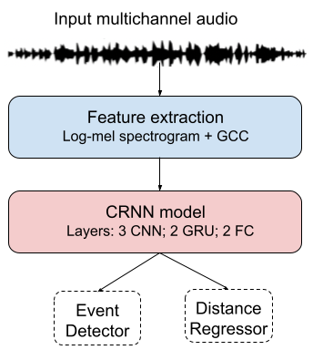

<p align="center">
  
</p>

## Environment creation
```
conda create --name dist python=3.8
conda activate dist
pip install -r requirements.txt
```

## Dataset Preparation :
Below we show the datasets used and their split. Each file has folder number as suffix.

| Dataset  | Train  |  Val | Test |
|----------|----------|----------|----------|
| DCASE | fold1 (765) | fold14 (135) | fold2 (300) |
| STARSS | fold3 (73) | fold15 (14) | fold4 (74) |
| LOCATA(with aug) | fold11 (192) | fold13 (24) | fold12 (5) |
| MARCO(with aug) | fold9 (34) | fold17 (6) | fold10 (7) |
| METU(with aug) | fold7 (1019) | fold16 (149) | fold8 (98) |

#### Manual unzip of MARCO is needed
```
cd data/download

wget https://zenodo.org/records/3474286/files/10%203D-MARCo%20Samples_Single%20sources.zip

UNZIP_DISABLE_ZIPBOMB_DETECTION=TRUE unzip 10\ 3D-MARCo\ Samples_Single\ sources.zip
```

#### Data preparation
The code will download, unzip and create folds. More can be found in the bottom section `More about datasets` below
```
python prepare_all_data.py
```

## Model Training:

#### Data Preprocessing
```
python dist_model_code/batch_feature_extraction.py 2
```

We first train the CRNN model for sound detection on DCASE data and use this pre-trained model as initialization for further distance + event detection experiments.

#### Event detection based pre-training:
We already provide a pre-trained model at ``models/pretrained_dcase_event_detector.h5 ``. So this step is optional.

Pretraining only the event classifier
```
python dist_model_code/train_seldnet.py 2
```

#### Distance estimation model training:

Training Locata with MSE(mean square error) loss 
```
python dist_model_code/train_seldnet.py 4
```

Training Starss with TAPE(Thresholded mean absolute error) threshold of 0.4 loss
```
python dist_model_code/train_seldnet.py 5
```

#### Hyperparameters
To train with your configuration add a new parameter in `parameters.py` file.
You need to mostly change these parameters
```
params['ind_data_train_test_split'] = [<TRAIN-FOLDS>, <VAL-FOLDS>, <TEST-FOLDS>]
params['pretrained_model_weights'] = <PRETRAINED-MODEL-PATH>
params['perm_3_loss_type'] = <LOSS-TYPE> # can be mse, mae, mspe, mape, thr_mape, thr_mspe 
params['perm_3_loss_mpe_type_thr'] = <THRESHOLD-VALUE> # only when perm_3_loss_type = thr_mape, thr_mspe
```

### Visualization
Some scripts for creating plots and diagrams are present in `probe/plot` directory.

## More about datasets 
`prepare_all_data.py` script downloads the data from these links 
- STARSS:  https://zenodo.org/records/7880637 
- DCASE (synthetic data with distance): https://huggingface.co/datasets/sakshamsingh1/sound_distance 
- LOCATA: https://zenodo.org/records/3630471 
- 3D-MARCo: https://zenodo.org/records/3477602 
- METU SPARG: https://zenodo.org/records/2635758

## Citation
If you make use of our work or data, please cite our paper:
```
@article{kushwaha2023sound,
  title={Sound Source Distance Estimation in Diverse and Dynamic Acoustic Conditions},
  author={Kushwaha, Saksham Singh and Roman, Iran R and Fuentes, Magdalena and Bello, Juan Pablo},
  journal={arXiv preprint arXiv:2309.09288},
  year={2023}
}
```


